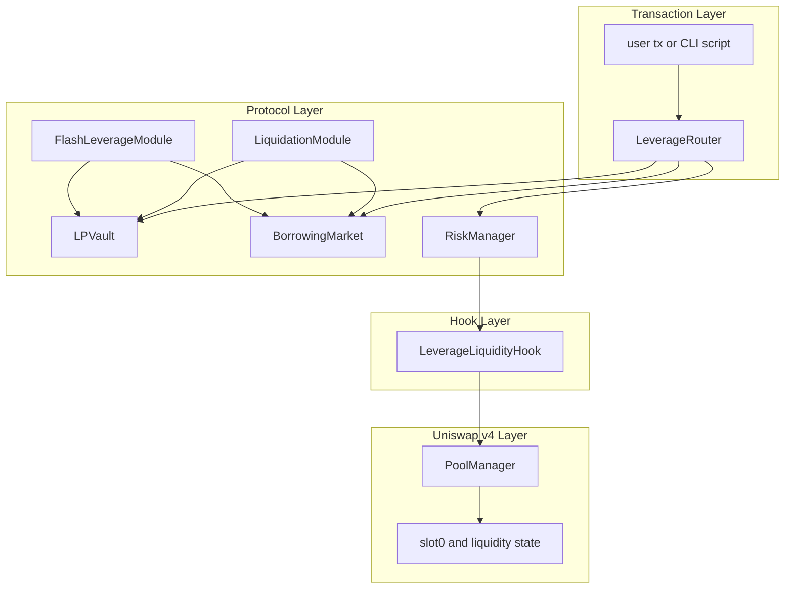
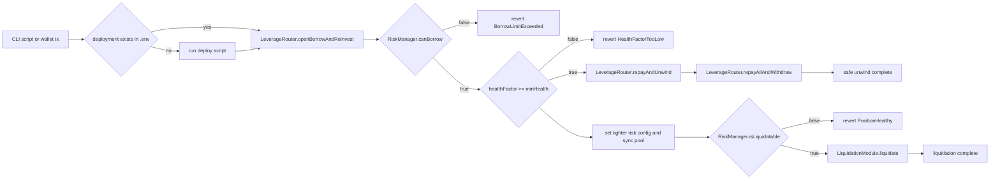
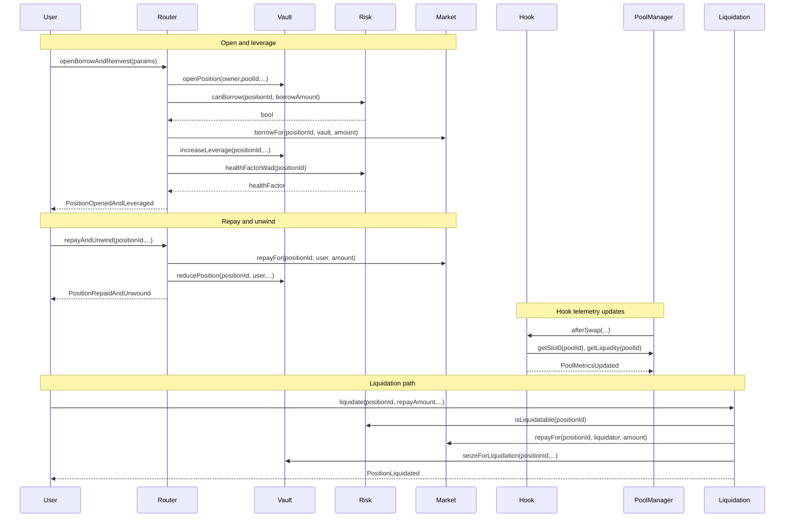

# Smart Borrow & Leveraged Liquidity Hook
**Built on Uniswap v4 · Deployed on Unichain Sepolia**
_Targeting: Uniswap Foundation Prize · Unichain Prize_

> A deterministic Uniswap v4 hook + lending vault system that lets users borrow against LP-aligned collateral and reinvest borrowed capital into the same pool to increase effective liquidity depth.


## The Problem
LP providers and leverage users still operate across disconnected execution paths, so borrowing and reinvestment are often split across multiple transactions with stale risk assumptions.

| Layer | Failure Mode |
| --- | --- |
| Execution | Borrow and reinvest are split across transaction boundaries |
| Risk | Static limits miss real-time pool volatility and depth changes |
| Collateral | LP-aligned collateral is not evaluated with deterministic penalties |
| Liquidation | Unhealthy positions resolve late or inconsistently |
| Capital Efficiency | Base capital cannot safely deepen same-pool liquidity |

The result is lower capital efficiency and higher liquidation exposure per unit of capital.

## The Solution
The protocol composes deterministic leverage as one on-chain state machine.

1. User opens a collateralized LP-aligned position through `LeverageRouter`.
2. `LPVault` records position ownership, pool metadata, and collateral balances.
3. `RiskManager` computes dynamic LTV from hook metrics and range geometry.
4. `BorrowingMarket` issues debt with O(1) scaled accounting and utilization-kink rates.
5. Borrowed asset is reinvested into the same position accounting path atomically.
6. Repay and unwind operations enforce post-action health checks.
7. `LiquidationModule` allows permissionless liquidation under bounded close-factor rules.

The key insight is to bind borrowing limits to live on-chain pool conditions at execution time.

## Architecture

### 8a. Component Overview
```text
src/
  hooks/LeverageLiquidityHook.sol          # Uniswap v4 hook; updates pool metrics
  LPVault.sol                              # Position custody and collateral accounting
  markets/BorrowingMarket.sol              # Supply/borrow/repay with indexed debt accrual
  RiskManager.sol                          # Dynamic LTV, health factor, liquidation predicates
  modules/LeverageRouter.sol               # Atomic open/borrow/reinvest and repay/unwind
  modules/LiquidationModule.sol            # Permissionless liquidations and bad-debt path
  modules/FlashLeverageModule.sol          # Optional bounded flash-leverage path
  mocks/MockToken.sol                      # Demo ERC20 assets
  mocks/MockFlashLoanProvider.sol          # Demo flash provider for callback path
  libraries/DataTypes.sol                  # Shared structs and fixed-point constants
```

### 8b. Architecture Flow (Subgraphs)


### 8c. User Perspective Flow


### 8d. Interaction Sequence


## Leverage Regimes
| Regime | On-Chain Condition | Allowed Action | Exit Condition |
| --- | --- | --- | --- |
| Collateralized | `debt == 0` and `position.active == true` | Borrow and reinvest | Debt opened |
| Leveraged Healthy | `debt > 0` and `debt <= liquidationValue` | Borrow, repay, unwind | Health declines or debt repaid |
| At Risk | `healthFactor` near `1e18` | Repay or partial unwind | Restored health or liquidation trigger |
| Liquidatable | `debt > liquidationValue` | Permissionless liquidation | Debt reduced or collateral exhausted |
| Closed | Collateral and leveraged liquidity withdrawn | None | Terminal |

A non-obvious behavior is that `repayAndUnwind` still reverts if remaining debt would leave health below `1e18`.

## Deployed Contracts

### Unichain Sepolia (chainId 1301)

| Contract | Address |
| --- | --- |
| MockToken0 | [0x2477b8687745f494931748f5355770ba72ed3830](https://sepolia.uniscan.xyz/address/0x2477b8687745f494931748f5355770ba72ed3830) |
| MockToken1 | [0xf61cd89a9e9b2b23ce0bdac6e19c3db52c56ac07](https://sepolia.uniscan.xyz/address/0xf61cd89a9e9b2b23ce0bdac6e19c3db52c56ac07) |
| LeverageLiquidityHook | [0x2d2a64dcd864ba1c83dd634a8c19c4f695db10c0](https://sepolia.uniscan.xyz/address/0x2d2a64dcd864ba1c83dd634a8c19c4f695db10c0) |
| LPVault | [0xdd008a1209bf0400c3e7c0b5a4d23e691ee43990](https://sepolia.uniscan.xyz/address/0xdd008a1209bf0400c3e7c0b5a4d23e691ee43990) |
| BorrowingMarket | [0xb4b2d15ebec35e21e2fbce3845bff476082cc628](https://sepolia.uniscan.xyz/address/0xb4b2d15ebec35e21e2fbce3845bff476082cc628) |
| RiskManager | [0x70df6c59673adaee5ac1354f1051bc6a232a3c53](https://sepolia.uniscan.xyz/address/0x70df6c59673adaee5ac1354f1051bc6a232a3c53) |
| LeverageRouter | [0x3642fa7e78acfabf2851619acdb92ac560efc746](https://sepolia.uniscan.xyz/address/0x3642fa7e78acfabf2851619acdb92ac560efc746) |
| LiquidationModule | [0x9148f61ad2d5cef6a7c43c6c951a816475cd1bfe](https://sepolia.uniscan.xyz/address/0x9148f61ad2d5cef6a7c43c6c951a816475cd1bfe) |
| MockFlashLoanProvider | [0xf72c2c426a71fca404b354bd4ca4e6659c387dec](https://sepolia.uniscan.xyz/address/0xf72c2c426a71fca404b354bd4ca4e6659c387dec) |
| FlashLeverageModule | [0x23856a24fb7e7aaca2ed7fef96f269269b4bd245](https://sepolia.uniscan.xyz/address/0x23856a24fb7e7aaca2ed7fef96f269269b4bd245) |

## Live Demo Evidence
Demo run date: **2026-03-11**.

### Phase 1 — Open Leverage (Unichain Sepolia, chainId 1301)

| Action | Transaction |
| --- | --- |
| Open collateralized leveraged position | [0x1447a844...](https://sepolia.uniscan.xyz/tx/0x1447a84424cb9b337fb5cc81ae87f2f42bad182c0584c5f1b9b1b0f6ff93129b) |

### Phase 2 — Repay and Unwind (Unichain Sepolia, chainId 1301)

| Action | Transaction |
| --- | --- |
| Partial repay and unwind | [0x37084f99...](https://sepolia.uniscan.xyz/tx/0x37084f9928ce7b0d77b88a8d1aae0b42c7c3b52c9b64379995695595e68c6a2b) |
| Full repay and withdraw | [0x3467555f...](https://sepolia.uniscan.xyz/tx/0x3467555f1b7208cf9e325132670b968f3b0aae58852a0a3157e24aacfa95bd24) |

### Phase 3 — Stress and Liquidate (Unichain Sepolia, chainId 1301)

| Action | Transaction |
| --- | --- |
| Open liquidation candidate position | [0x722e7ed8...](https://sepolia.uniscan.xyz/tx/0x722e7ed86bb34c748b17a6226ec62dbcfd4f8ba25b324d8a4f0512479971bb6f) |
| Sync hook pool metrics | [0x043a58cd...](https://sepolia.uniscan.xyz/tx/0x043a58cdda1d26262a5fd573c9945b8fc3f53d508d0bde7cc8bb0e240b1c33d5) |
| Tighten risk configuration | [0xbebb1040...](https://sepolia.uniscan.xyz/tx/0xbebb10404da3382b3288b65020fdfdecff385f4d68d9baeffc0399473655720f) |
| Execute permissionless liquidation | [0x10fc8b7e...](https://sepolia.uniscan.xyz/tx/0x10fc8b7ee5b60ece2305c39d1ecff9e2c64c01b0925250bd8e572772e9046397) |

> Demo script logs (`debt`, `healthFactorWad`, `maxBorrowQuote`, `liquidationValueQuote`) are live chain reads emitted by `DemoUsingDeploymentScript._logPositionState`.

## Running the Demo

```bash
# full testnet lifecycle: deploy-if-needed + leverage + repay + liquidation
./scripts/demo-testnet.sh all
```

```bash
# testnet leverage and repay phases only
./scripts/demo-testnet.sh leverage
```

```bash
# testnet liquidation phase only
./scripts/demo-testnet.sh liquidate
```

```bash
# local full lifecycle demo on Anvil
make demo-local
```

```bash
# local leverage-focused demo
make demo-leverage
```

```bash
# local liquidation-focused demo
make demo-liquidate
```

## Test Coverage

```text
Lines: 100.00% (515/515)
Statements: 98.68% (671/680)
Branches: 87.39% (97/111)
Functions: 100.00% (89/89)
```

```bash
FOUNDRY_FUZZ_RUNS=64 FOUNDRY_INVARIANT_RUNS=64 forge coverage --ir-minimum --report summary --exclude-tests --no-match-coverage "script|test|lib|src/mocks"
```

- Unit: contract logic, access control, edge branches.
- Fuzz: LTV bounds, debt monotonicity, liquidation guards, flash path.
- Invariant: debt snapshot consistency and healthy/liquidatable complement.
- Integration: full lifecycle with live v4 interactions.
- Hook-focused: permissions, swap callbacks, and EWMA update behavior.

## Repository Structure
```text
.
├── src/
├── scripts/
├── test/
└── docs/
```

## Documentation Index

| Doc | Description |
| --- | --- |
| [docs/overview.md](./docs/overview.md) | Problem framing, guarantees, and component summary |
| [docs/architecture.md](./docs/architecture.md) | System boundaries, state ownership, and data flow |
| [docs/risk-model.md](./docs/risk-model.md) | Dynamic LTV formulas, penalties, and worked example |
| [docs/borrowing-market.md](./docs/borrowing-market.md) | Utilization-kink rates and indexed debt accounting |
| [docs/liquidations.md](./docs/liquidations.md) | Thresholds, incentives, and bad-debt handling |
| [docs/security.md](./docs/security.md) | Threat model, mitigations, and residual risks |
| [docs/deployment.md](./docs/deployment.md) | Local and Unichain deployment steps and outputs |
| [docs/demo.md](./docs/demo.md) | End-to-end demo phases and evidence artifacts |
| [docs/api.md](./docs/api.md) | Contract-level API summary |
| [docs/testing.md](./docs/testing.md) | Test taxonomy and execution commands |
| [spec.md](./spec.md) | Protocol specification and formulas |

## Key Design Decisions

**Why keep the hook minimal?**  
The hook only tracks deterministic pool telemetry and callback permissions. Credit logic stays outside callback execution to reduce callback attack surface and simplify audits. A heavy hook was rejected because it couples risk, debt, and callback code into one failure domain.

**Why use indexed O(1) debt accounting?**  
`BorrowingMarket` stores scaled debt and a global borrow index, so accrual is constant-time and user count independent. This keeps liquidation and repayment gas predictable. Per-user iterative accrual was rejected because it breaks deterministic cost behavior.

**Why use in-pool valuation with conservative penalties?**  
Risk uses only on-chain pool and position data: tick, depth, range width, and range-center distance. Penalties lower LTV under stressed conditions without off-chain oracle dependencies. External oracle dependency was rejected for this deterministic first release.

**Why enforce permissionless liquidation with bounded close factor?**  
Liquidation is open to any caller but bounded by `closeFactorBps` and seize checks. This preserves liveness without keeper dependency and limits over-seizure per transaction. Keeper-only liquidation was rejected because it creates external liveness assumptions.

## Roadmap

- [x] Public Unichain Sepolia deployment and proof-chain demos
- [x] Unit, fuzz, invariant, and integration test suites in CI
- [ ] External audit and remediation cycle
- [ ] Governance hardening with timelocked parameter changes
- [ ] Multi-pool presets for stable-like and volatile-like classes
- [ ] Reserve withdrawal and fee accounting module

## License
MIT
