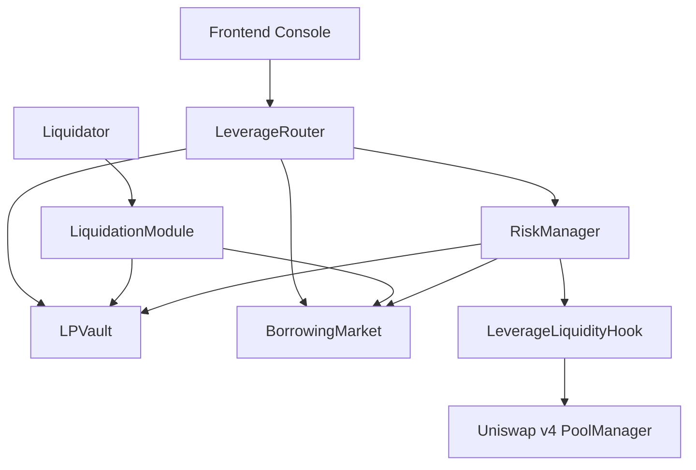
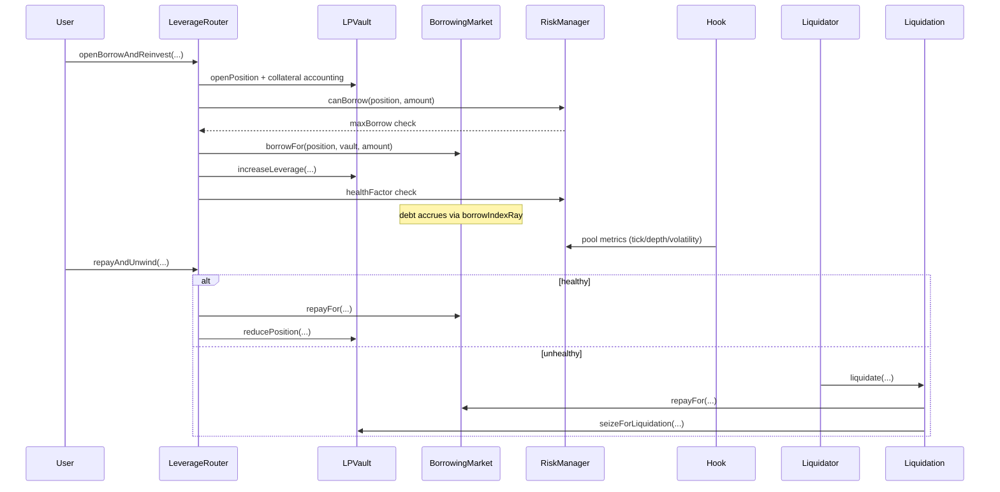
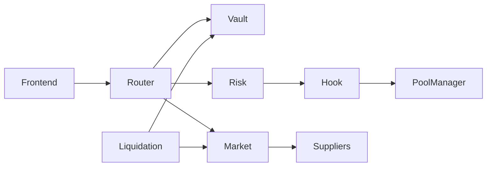

# Smart Borrow & Leveraged Liquidity Hook

<p>
  
  
  
</p>

Deterministic Uniswap v4 hook + lending vault system for:

- borrowing against LP-aligned collateral,
- reinvesting borrowed capital into the same market,
- enforcing dynamic LTV, utilization-based rates, and permissionless liquidations,
- running without keepers, bots, or reactive off-chain components.

## Why this exists

LP capital is often fragmented between providing liquidity and sourcing borrow liquidity. This primitive allows a user to keep capital concentrated in one strategy loop:

`deposit collateral -> borrow -> reinvest -> deeper effective liquidity`

with on-chain risk controls.

## Architecture







## Contracts

- `src/hooks/LeverageLiquidityHook.sol`
- `src/LPVault.sol`
- `src/markets/BorrowingMarket.sol`
- `src/RiskManager.sol`
- `src/modules/LeverageRouter.sol`
- `src/modules/LiquidationModule.sol`
- `src/modules/FlashLeverageModule.sol` (optional flash path)
- `src/mocks/MockToken.sol`, `src/mocks/MockFlashLoanProvider.sol`, `src/mocks/MockMetricsHook.sol`

## Risk model summary

- price proxy: Uniswap tick-derived in-pool value conversion,
- dynamic penalty: volatility EWMA + depth shortfall + range narrowness + distance from range center,
- dynamic LTV:
  - `adjustedLtv = max(minLtv, baseLtv - penalty)`,
- collateral factor:
  - `adjustedCF = max(minCF, baseCF - penalty/2)`,
- liquidation:
  - unhealthy if `debt > liquidationValue`.

Full formulas and examples: [docs/risk-model.md](./docs/risk-model.md)

## Monorepo layout

```
.
├── .github/workflows/
├── assets/
├── context/
├── docs/
├── frontend/
├── lib/
├── script/
├── scripts/
├── shared/
├── src/
├── test/
├── foundry.toml
├── remappings.txt
├── foundry.lock
├── Makefile
├── spec.md
└── README.md
```

## Dependency determinism

- Foundry dependencies are git submodules.
- `scripts/bootstrap.sh` initializes, pins, and verifies Uniswap dependency revisions.
- `shared/abis` is generated deterministically from Foundry artifacts.

> Note: challenge text references commit `3779387`; upstream OpenZeppelin v4-template dependency graph in this repo resolves to `a7cf038cd568801a79a9b4cf92cd5b52c95c8585` for v4-core/periphery linkage. `UNISWAP_V4_COMMIT` is configurable in bootstrap and CI.

## Quickstart

```bash
./scripts/bootstrap.sh
forge test
```

## Demo commands

```bash
make demo-local
make demo-leverage
make demo-liquidate
make demo-all
make demo-testnet
```

## Deploy

```bash
forge script script/deploy/DeployProtocol.s.sol:DeployProtocolScript \
  --rpc-url $RPC_URL \
  --private-key $PRIVATE_KEY \
  --broadcast
```

`Demo*` scripts print deployed addresses during execution. Explorer URLs are chain-specific and can be resolved from broadcast tx hashes (`broadcast/*`).

### Deployment Records

| Network | Hook | Vault | Market | RiskManager | Router | Liquidation | FlashModule | Explorer |
| --- | --- | --- | --- | --- | --- | --- | --- | --- |
| Anvil local | TBD | TBD | TBD | TBD | TBD | TBD | TBD | TBD (local) |
| Base Sepolia | TBD | TBD | TBD | TBD | TBD | TBD | TBD | TBD (chain-specific) |

For each broadcast run, keep the transaction hashes from Foundry output and map them to explorer URLs in this table.

## Frontend console

```bash
make frontend
# open http://127.0.0.1:4173/frontend/
```

Configure addresses in `frontend/app.js` and reuse ABIs from `shared/abis`.

## Testing

- Unit tests: market, router, risk manager, liquidations.
- Fuzz tests: borrow bounds, debt monotonicity, liquidation predicate, flash path.
- Invariant tests: debt/snapshot consistency and healthy/liquidatable equivalence.
- Integration tests: lifecycle on real v4 pool path.

Run all:

```bash
forge test
```

## Documentation index

- [spec.md](./spec.md)
- [docs/overview.md](./docs/overview.md)
- [docs/architecture.md](./docs/architecture.md)
- [docs/risk-model.md](./docs/risk-model.md)
- [docs/borrowing-market.md](./docs/borrowing-market.md)
- [docs/liquidations.md](./docs/liquidations.md)
- [docs/security.md](./docs/security.md)
- [docs/deployment.md](./docs/deployment.md)
- [docs/demo.md](./docs/demo.md)
- [docs/api.md](./docs/api.md)
- [docs/testing.md](./docs/testing.md)
- [docs/frontend.md](./docs/frontend.md)
